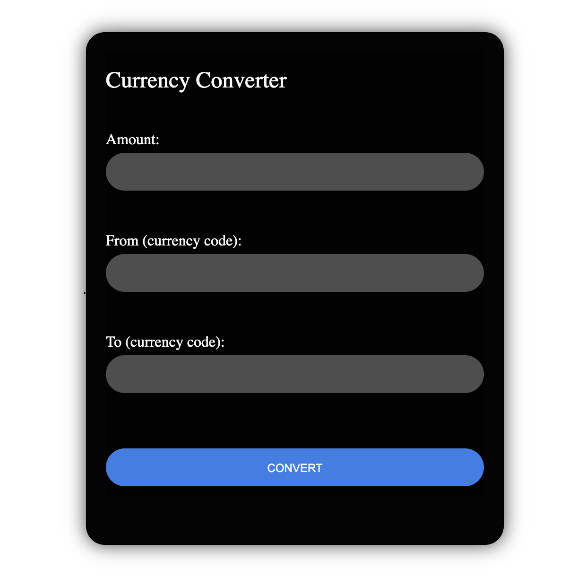

# Currency-convertor
In this task, I used “Frankfurter API” to create the currency converter website on PHP. I used HTML
and CSS for its interface design. In the interface, User needs to fill amount, and proper currency
code. After pressing “Convert” button, this website provides the amount in converted currency.

 
 
 

---

## 🖼 Preview

  

---

## 🌐 Live Demo

Try it live:  
[https://mywaterlab5.iceiy.com/script.php](https://mywaterlab5.iceiy.com/script.php)

---

## 🛠 Technologies Used

- HTML5  
- CSS3  
- PHP  
- Git & GitHub Pages  

---

## 📄 License

MIT License © Bayardorj Dagdandorj

